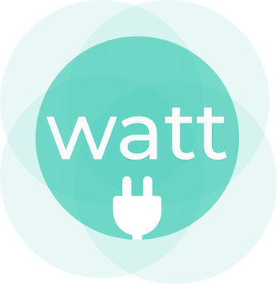
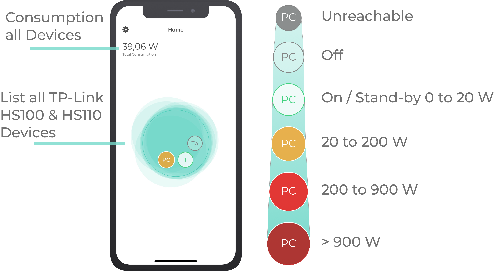
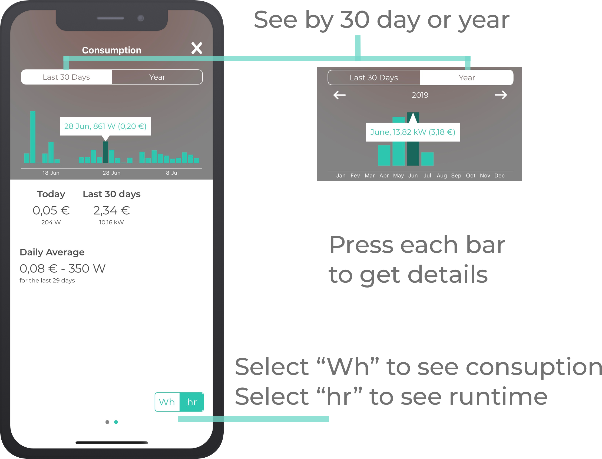

# Watt for Kasa Smart

  

> ⚠️ **If you are using mobile browser**: Press the button "View all" to see all the page including the **Roadmap!**
 

:warning: **If you are using mobile browser**: Press the button "View all" to see all the page including the **Roadmap!**
 

Watt is an iOS mobile app developed for the TP-Link's Smart Plugs, that allows you to set cost for each kilowatt(kW) and by doing this you have control of the cost in each device.

With this page of GitHub, I hope to develop a small community to report problems with the application and think of solutions.

# Features

- Daily & monthly energy usage totals and averages and money cost.
- Historical daily and monthly energy usage charts and Runtime (hours that the device was on).
- Turn on/off the device
- Show cumulative energy usage form all devices.

  

| Featured | HS100 | HS110 |
| --- | :---: | :---: |
| Turn On/Off | x | x |
| Get overview each device that are active  in the home screen | x | x |
| Energy consumption Chart   Daily & monthly |  | x |
| Daily and monthly cost of the device |   | x |
| Runtime Chart   Daily & monthly | x | x |
| Cumulative energy usage  form all devices |   | x |

  

   

  

# Issues

If you have any issue or suggestion, open a new ticket by pressing on the top of this page "issues" then "New issue".

# Others

Link to the App:

[https://itunes.apple.com/us/app/watt-hs110/id1465004830](https://itunes.apple.com/us/app/watt-hs110/id1465004830)

Here you can find the video (old):

[https://youtu.be/zFgz4oVbX0c](https://youtu.be/zFgz4oVbX0c)

# Roadmap

- [x] Show cumulative energy usage form all devices.
- [x] Show energy consumption by last 30 days, month.
- [x] Show daily cost metrics
- [x] Make it work with HS100
- [ ] Export the data to Excel (csv)
- [ ] Show more info about each device (Like real time consumption, Voltage, wireless signal)
- [ ] Show chart gathering all devices and the total cost.
- [ ] Record the energy consumption hour by hour (background fetch)
- [ ] Show energy consuption by day, bill.
- [ ] The option to define peak and off peak times and electricity prices.
- [ ] The ability to reset the stats for when a different appliance/device is plugged in and I want to start fresh.
- [ ] Option to turn off the led light.
- [ ] Find a way to give commands to Siri to turn on/off device (maybe using Siri shortcut)
- [ ] Create concept "Room" which will aggregate multiple devices.
- [ ] Make smart action (like if consuption is lower then specific value turn off, or using GPS and when arrive home turn on the light or even use weather forcast to make action)
- [ ] Make a personalized schedule that  will tell you how much money you will save by turning off your device x hours
- [ ] Set Goals to save energy
- [ ] Implement Haptic Touch
- [ ] Add Artificial Intelligence (IA) to detect and send you push notification when some consumption is not right like: leave the refrigerator door open
- [ ] If you have multiple devices connected to single HS110 use artificial intelligence to detect which devices are turned on and off and how much each one of them are spending.
- [ ] Make android version
